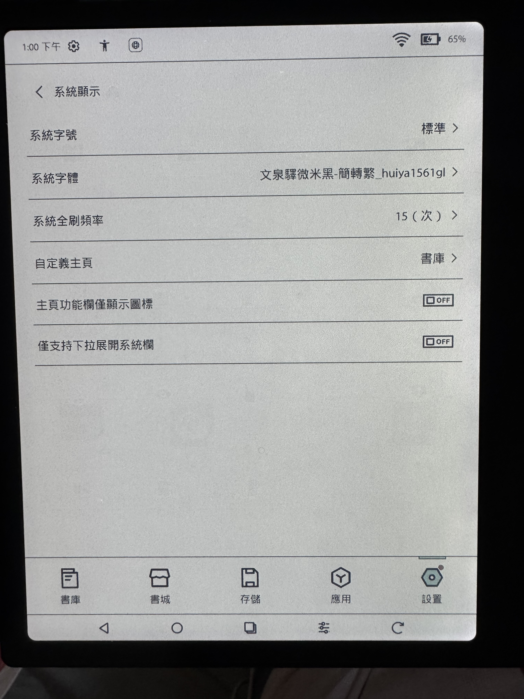
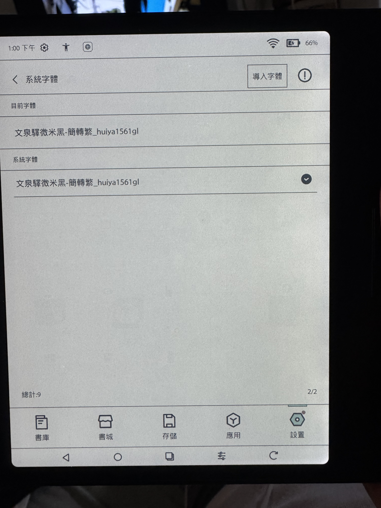

# Boox 機器繁體字體安裝教學

## 1️⃣ 下載繁體字體檔
👉 [文泉驛微米黑 - 簡轉繁版.ttf](https://github.com/scott122tw/boox_go_color/blob/main/%E6%96%87%E6%B3%89%E9%A9%9B%E5%BE%AE%E7%B1%B3%E9%BB%91-%E7%B0%A1%E8%BD%89%E7%B9%81.ttf)

---

## 2️⃣ 將字體放入 Boox 機器

- **步驟 a**：將字體檔放入根目錄下的 `fonts` 資料夾。  
  ※ 若無此資料夾，請自行建立。

- **步驟 b**：  
  - Mac 使用者無法直接開啟 Boox 檔案，需先安裝以下工具：  
    👉 [Mac for USB (電腦傳輸用).dmg](https://github.com/scott122tw/boox_go_color/blob/main/Mac%20for%20USB(%E9%9B%BB%E8%85%A6%E5%82%B3%E8%BC%B8%E7%94%A8).dmg)

---

## 3️⃣ Boox 系統內設定

- 開啟 **[設置] → [系統字體] → [導入字體]**
- 選擇剛剛上傳的繁體字體
- 導入完成後，將 **系統字體** 切換為該字體

---

## 4️⃣ 成功效果預覽

打開微信讀書，即可看到繁體顯示效果！

